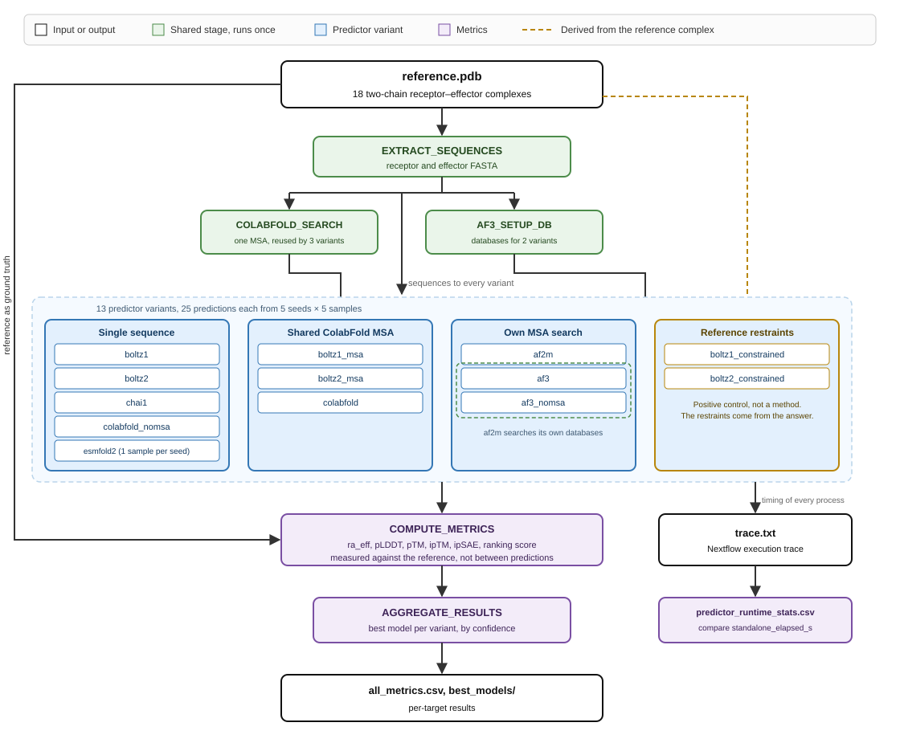

# Structure Prediction Benchmarking

[](https://github.com/joshuandwilliams/structure-prediction-benchmarking/actions/workflows/test.yml)
[](https://github.com/joshuandwilliams/structure-prediction-benchmarking/actions/workflows/lint.yml)
    

A Nextflow DSL2 pipeline that benchmarks deep-learning protein complex structure predictors against solved reference complexes. Given a two-chain reference PDB it runs each predictor across five seeds, scores how accurately the effector is placed on the receptor, and produces one ranked table plus each predictor's best model.

Built for the 18 solved NLR integrated-HMA-domain and MAX-effector complexes of the Pik and RGA5 families, which is every such structure in the PDB.

## Status

The pipeline and its analyses are ready to run. The committed results in `data/metrics/` are stale, and every figure derived from them will change. They came from a configuration with three defects, all now fixed:

- five variants were given the reference effector as a structural template while the other eight were not, which confounded the model comparison
- AF2-Multimer and AlphaFold 3 could retrieve benchmark complexes themselves through their built-in template searches
- `ipsae_min` used a non-standard `d0`, and the AlphaFold ranking score was mislabelled `actifptm`

Re-running costs roughly 69 GPU-hours across the 18 targets. Regenerate the metric CSVs afterwards with `scripts/build_metrics_csvs.sh`, then re-render the analyses.

Coverage is enforced at 100% over `bin/`. Every line is either exercised by a test or carries a `# pragma: no cover` naming why it cannot be. The interface classifiers are covered by synthetic poses built from the committed references, so they are testable before a run exists rather than after it.

## How it runs



`workflow.onComplete` filters the Nextflow trace down to the predictor processes, so the runtime table measures prediction rather than scheduling. `bin/trace_to_runtime_csv.py` folds `COLABFOLD_SEARCH` time into the MSA variants that consumed it, which is why `standalone_elapsed_s` rather than `elapsed_s` is the comparable column.

## Design decisions

**Templates.** Every variant in the model comparison is template-free. Uniformity is only reachable downward, because AF2-Multimer, ESMFold2 and AlphaFold 3 with an MSA accept no custom template. Reaching that state needed more than declining to pass a file. `AF2M` and `AF3` pin `--max_template_date=1900-01-01`, since their built-in searches would otherwise retrieve 10 and 13 of the 18 benchmark complexes. `COLABFOLD_SEARCH` runs `--use-templates 0`.

**Sampling.** Five seeds (42, 123, 456, 789, 1024) by five diffusion samples gives 25 predictions per variant. ESMFold2 returns one per seed, so five. Per-prediction costs must divide by the right number. All nine Boltz processes share `bin/run_boltz_seeds.sh`.

**Constraints.** Boltz-1 takes a pocket block only, since its schema forces `max_distance` to 6.0 and rejects contacts. Boltz-2 adds dense per-pair contacts. Both emit Boltz token indices, not author numbering, because Boltz renumbers its input 1..N and author-numbered constraints are silently dropped. Constrained variants are a positive control rather than a method, since their restraints come from the answer.

**Parser indirection.** `MODEL_TO_PARSER` maps each variant to its output format, so `boltz1_msa` parses as `boltz1` while keeping its own tag. `combine_metrics.MODEL_MAP` reverses this for the analyses. The three `*_template` variants must be listed there explicitly, because the fallback heuristic keys off a trailing `_msa` and would mislabel `boltz2_msa_template`.

**Nextflow version.** `main.nf` needs the legacy parser. Version 26 made the strict parser the default, and it rejects every top-level `def`. The container pins 25.10.4. Set `NXF_SYNTAX_PARSER=v1` to compile it under a newer local Nextflow. A top-level `def` is invisible inside a function, so `selected_models()` takes `ALL_MODELS` as an argument.

## The two runs

Two runs over the same 18 targets answer two different questions.

Run 1 asks which model places the effector best. Thirteen variants receive receptor sequence and effector sequence and nothing else. Uniform inputs are what make them comparable.

| Model | Variants | MSA source |
|------------------------|------------------------|------------------------|
| Boltz-1 | `boltz1`, `boltz1_msa`, `boltz1_constrained` | single-seq / shared ColabFold / single-seq |
| Boltz-2 | `boltz2`, `boltz2_msa`, `boltz2_constrained` | single-seq / shared ColabFold / single-seq |
| Chai-1 | `chai1` | single-seq |
| AlphaFold2-Multimer | `af2m` | full AF2 search |
| AlphaFold 3 | `af3`, `af3_nomsa` | full AF3 search / none |
| ColabFold | `colabfold`, `colabfold_nomsa` | shared ColabFold / none |
| ESMFold2 | `esmfold2` | none |

Run 2 asks what the known effector fold is worth. The three Boltz-2 variants re-run with the reference effector supplied as a structural template, named `boltz2_template`, `boltz2_msa_template` and `boltz2_constrained_template`. Each pairs with its template-free twin in Run 1 and differs in nothing else.

Run 2 is not part of the model comparison and must not be pooled with it.

## Running it

The pipeline runs on the HPC; the local repo is for editing.

``` bash
cd experiments/benchmarks/6G10

sbatch ../../../run_benchmark.slurm.sh ./params.yml           # Run 1
sbatch ../../../run_benchmark.slurm.sh ./params_template.yml  # Run 2
```

Submit Run 2 from the same directory with `-resume` so the shared `COLABFOLD_SEARCH` result is reused rather than recomputed. That search takes about 34 minutes per target.

To submit all 18 as a throttled SLURM job array, Run 1 first:

``` bash
bash scripts/run_benchmarks.sh --tiers 1 --pdbs 6G10 --list   # preview one target
bash scripts/run_benchmarks.sh --tiers 1 --pdbs 6G10          # smoke test on one
bash scripts/run_benchmarks.sh --tiers 1                      # Run 1, all 18
bash scripts/run_benchmarks.sh --tiers 1 --params params_template.yml
```

Start with a single target. `--pdbs` takes a comma-separated list and validates each name against the tier set, so a typo fails at submission rather than running nothing.

`run_benchmarks.sh` is both the launcher and the array task: run from the login node it scans, freezes a PDB list and re-submits itself with `sbatch --array=0-N%K`; inside those jobs `SLURM_ARRAY_TASK_ID` is set, so it takes the array branch instead and hands one target to the driver.

Targets already carrying an `all_metrics.csv` under that params file's `outdir` are skipped, so a re-submission only picks up outstanding work. Pass `--include-complete` to override, and `--list` to preview without submitting.

Before the first submission, confirm the deployed AlphaFold 3 build accepts the template-date flag:

``` bash
run_alphafold.py --help | grep max_template_date
```

## What it measures

**Pose accuracy** is `rmsd_effector_receptor_aligned` ("ra_eff"). Receptor and effector Cα are paired by global sequence alignment (BLOSUM62, gap −10/−0.5), a Kabsch superposition is fitted on the receptor, and that transform is applied to the effector. Under 5 Å counts as correctly posed. Chain identity is resolved by sequence rather than by label, since Boltz writes A/B regardless of the input.

**Confidence** is pLDDT, pTM, ipTM, interface PAE, `ipsae_min` and `ranking_score`. ipSAE follows Dunbrack (2025), including its subset-derived `d0`. `ranking_score` is AlphaFold-Multimer's `0.8·ipTM + 0.2·pTM`. It is deliberately not called actifpTM, which needs a distogram no predictor here saves. Chai-1 emits no PAE, so its PAE-derived columns are blank.

**Which prediction represents a model** is the one with the highest average pLDDT, published to `best_models/`. That choice has to be reference-free, since selecting the lowest-RMSD prediction needs the answer and reports an oracle no pipeline could reach on a novel target. On this set, pLDDT selection poses 49.5% of targets correctly against 47.2% for the ranking score and 46.8% for ipTM, where selecting on RMSD would give 56.5%. pLDDT is compared only within one model, so the Boltz 0-1 against AlphaFold 0-100 scale difference does not affect selection.

**Cost** comes from Nextflow's own trace. Use `standalone_elapsed_s`, which folds the shared MSA search into the variants that depend on it; raw `elapsed_s` gives those variants a free MSA search.

## Repo layout

```         
bin/          Python the Nextflow processes invoke, plus the two underscore-
              prefixed libraries the scripts and analyses share
modules/      One Nextflow module per predictor or stage
data/         Reference structures, the manifest, and metrics/, the committed
              CSVs the analyses read
experiments/  Per-target run directories. Params tracked, outputs gitignored
analysis/     One folder per analysis, each with its own thesis-figures/ and
              supplementary-figures/
tests/        Three tiers under characterization/, plus the SLURM wrapper
containers/   Singularity definition files. Images live on the HPC
scripts/      HPC sync, benchmark submission, and reference-set preparation
```

Each analysis folder holds its `.qmd`, its rendered `.html`, and its own `thesis-figures/` and `supplementary-figures/`, so a figure's provenance is its directory. `bin/_analysis_common.py` is the library all ten import; its figure paths are relative, and Quarto sets the working directory to the rendering document's folder.

## Data

`data/benchmark_complexes.tsv` is the manifest. `extract_benchmark_complexes.py` builds each reference as a clean two-chain PDB with **chain A = plant protein** and **chain B = pathogen effector**, choosing the chain pair with the most Cα–Cα contacts so a multi-copy crystal still yields a genuinely bound pair, and stripping heteroatoms.

``` bash
bash scripts/download_solved_structures.sh      # needs internet
python scripts/extract_benchmark_complexes.py   # needs gemmi
```

Both are idempotent, and re-running the extractor over the committed references reproduces them byte-identically.

## Regenerating the committed metrics

`data/metrics/` holds the CSVs the analyses read, committed so they render without a pipeline run. All but `reference_similarity.csv` and `pdb_release_dates.csv` are derived from benchmark run outputs, so they are only valid for the run that produced them and must be rebuilt after any re-run.

``` bash
bash scripts/build_metrics_csvs.sh              # all of them
bash scripts/build_metrics_csvs.sh --skip-runs  # only the run-independent two
```

## Analysis environment

`environment.yml` pins the conda environment the Quarto analyses render in. It contains no structure predictor. Those live in the Singularity images built from `containers/`, and AlphaFold2-Multimer and AlphaFold 3 load from the HPC source-package system.

``` bash
mamba env create -f environment.yml
mamba activate spb-analysis
cd analysis/01-pose-accuracy && quarto render 01-pose-accuracy.qmd
```

Each analysis renders from its own folder, which is what puts its figures in that folder's `thesis-figures/` and `supplementary-figures/`.

## Tests

Three tiers, one marker each.

| Tier | Where it runs | Covers |
|:-----------------------|:-----------------------|:-----------------------|
| `local_unit` | anywhere with Python | pure helpers on synthetic input |
| `local_integration` | Mac, no HPC | the committed references and metrics |
| `hpc` | HPC only | a GPU, the containers, or a finished run |

``` bash
pip install -e '.[test]'
pytest -m local_unit                          # fastest
pytest -m "local_unit or local_integration"   # everything runnable on a Mac
pytest                                        # all three
sbatch tests/run_pytest.slurm.sh              # on the cluster
```

Only two tests need the cluster. One folds a sequence with ESMFold2 and needs a GPU. The other walks a published `best_models/` tree to confirm the layout still matches what the script expects, and takes `SPB_BENCHMARKS_DIR` to point somewhere other than `experiments/benchmarks`. Both skip cleanly when their inputs are absent rather than failing.

The interface classification logic is tested without either. Poses with a known answer are built from the committed reference structures by rigid transform, one on the true AVR-Pik surface, one moved onto the AVR-Pia surface, one displaced clear of both. The expected label follows from the construction, so the tests assert the classification is right rather than merely non-empty. See `tests/characterization/fixtures/build_interface_fixtures.py`.

`local_unit` covers the ipSAE and `d0` maths, the RMSD/Kabsch/alignment path, constraint geometry, model-name mapping, sequence extraction, the AF3 JSON and the Nextflow trace parser.

Every run writes coverage to `lcov.info` and `htmlcov/`, both gitignored. Open `htmlcov/index.html` for the browsable report, or install the Coverage Gutters extension and run "Coverage Gutters: Watch" to shade covered and uncovered lines in the editor.

Coverage over `bin/` reads low because several scripts are exercised through their CLIs, the way Nextflow calls them, and `coverage` does not follow child processes.